# Neural Network Library - Technical Architecture Overview

## Executive Summary

The `nn.pl` neural network library implements a modular, composable deep learning framework inspired by Torch/nn. The library provides implementations in multiple languages (Lua/Torch, Prolog, C) sharing a common architectural design based on the Module pattern, enabling construction of arbitrary neural network topologies through composition.

## System Architecture

### High-Level Architecture

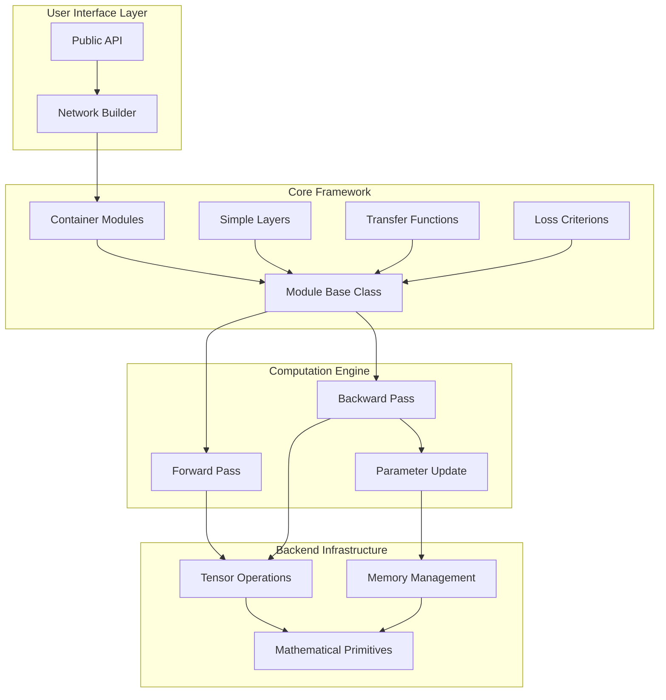

### Multi-Language Implementation Architecture

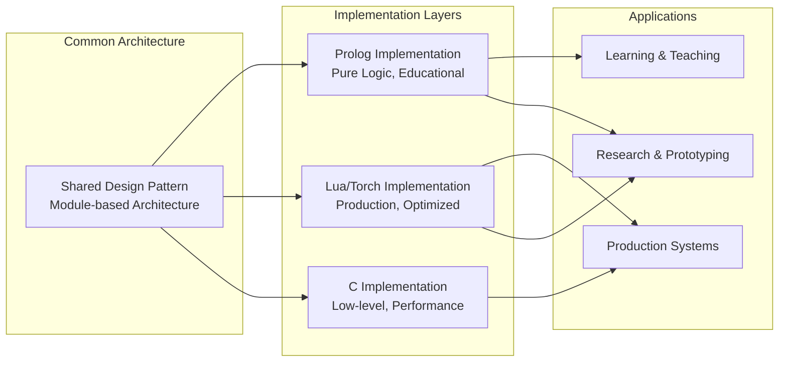

## Core Components

### 1. Module Pattern

The Module is the fundamental abstraction for all neural network components.

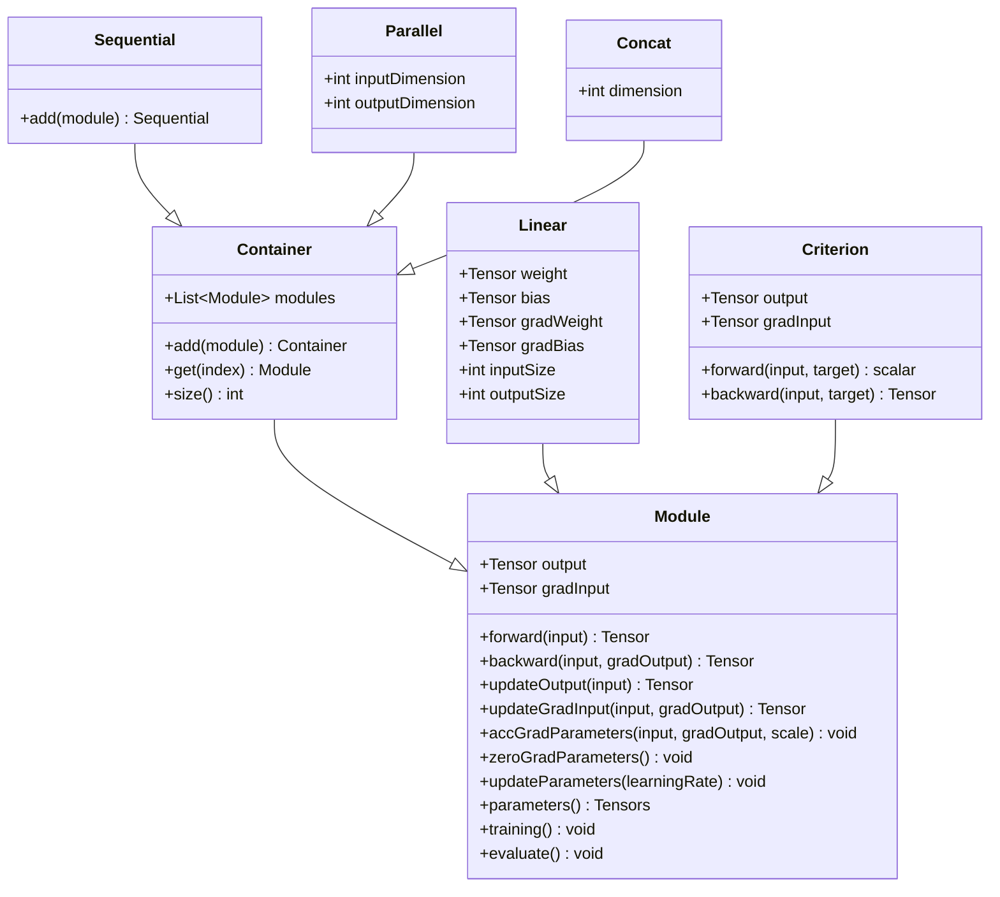

### 2. Container Modules

Containers compose multiple modules into complex architectures.

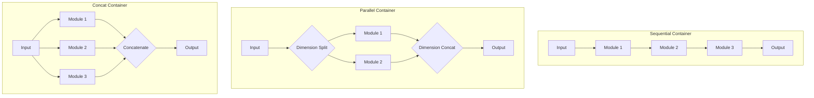

### 3. Forward and Backward Propagation

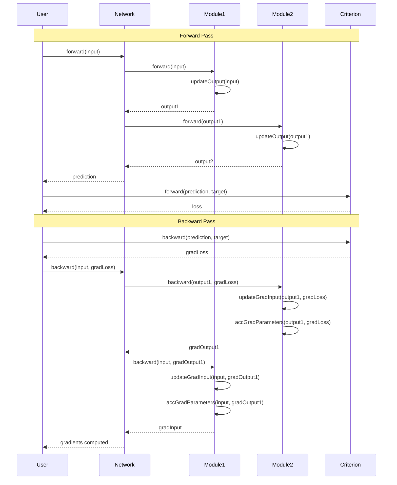

## Data Flow Architecture

### Training Data Flow

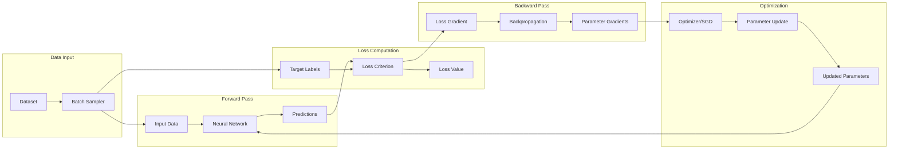

### Module State Transitions

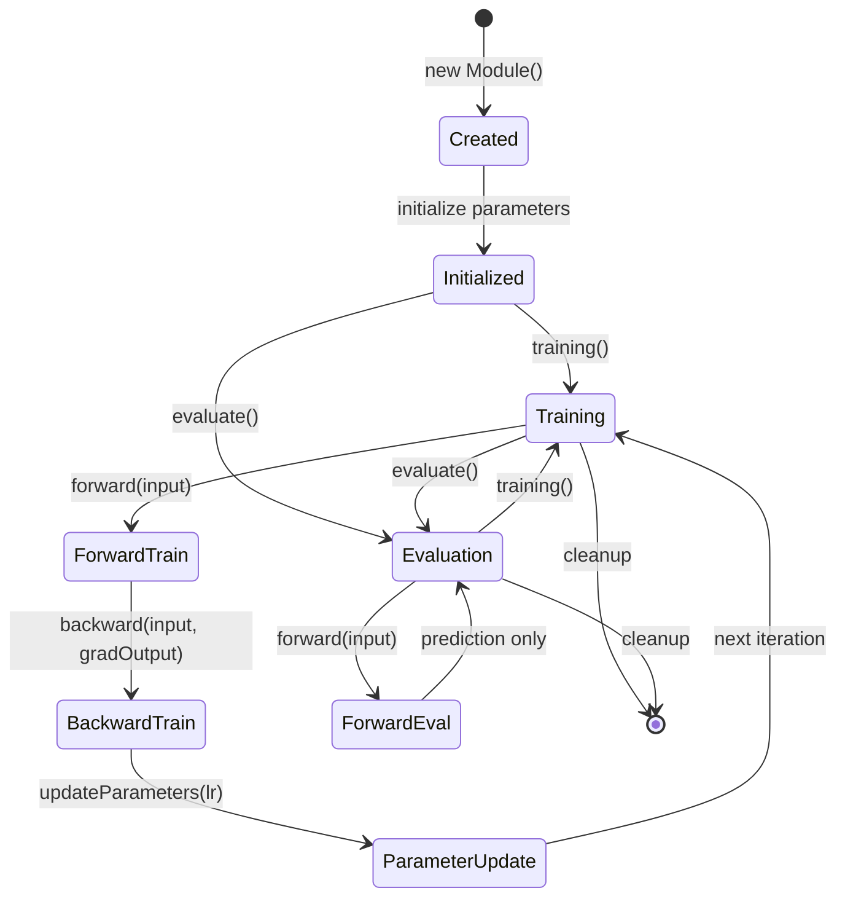

## Component Interaction Patterns

### 1. Module Composition Pattern

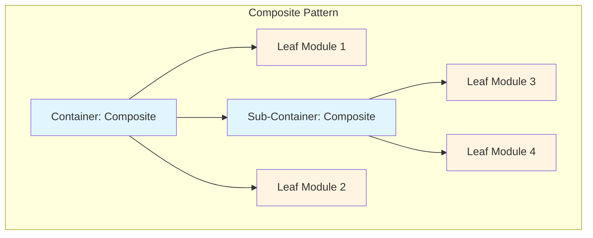

### 2. Layer Communication Pattern

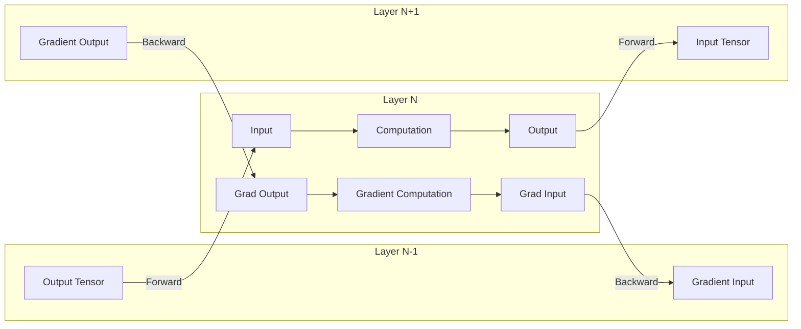

## Tensor Operations Infrastructure

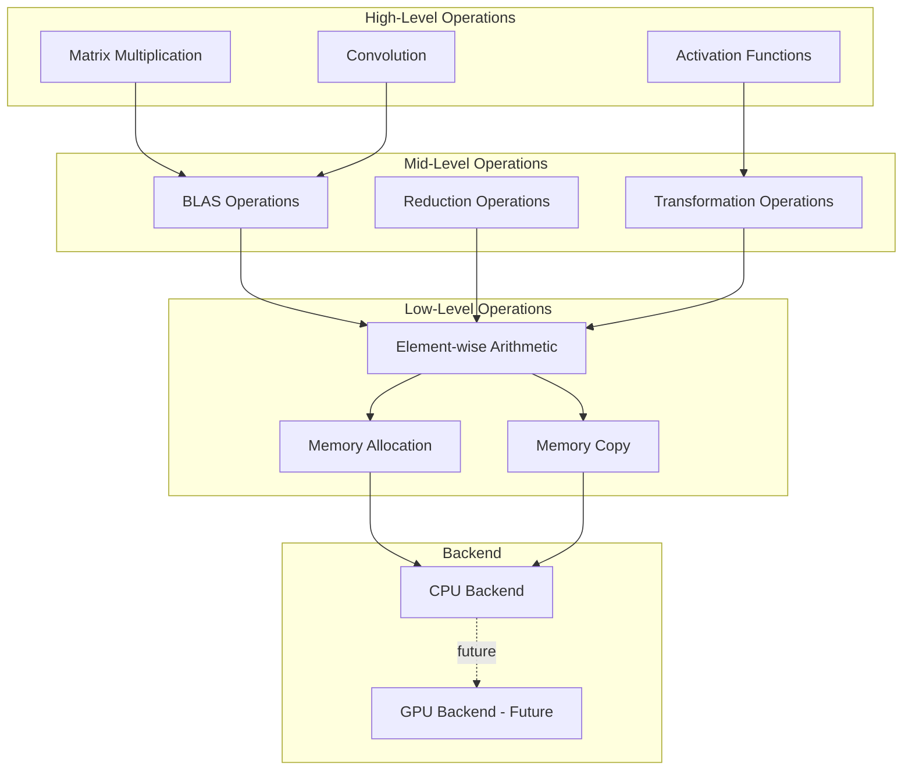

## Module Hierarchy

### Complete Module Taxonomy

```mermaid
graph TB
    Module[Module - Abstract Base]
    
    Module --> Container[Container]
    Module --> SimpleLayer[Simple Layers]
    Module --> TransferFn[Transfer Functions]
    Module --> ConvLayer[Convolutional Layers]
    Module --> TableLayer[Table Layers]
    
    Container --> Sequential
    Container --> Parallel
    Container --> Concat
    Container --> ConcatTable
    
    SimpleLayer --> Linear
    SimpleLayer --> Reshape
    SimpleLayer --> Mean
    SimpleLayer --> Max
    SimpleLayer --> Add
    SimpleLayer --> CMul
    SimpleLayer --> Identity
    
    TransferFn --> Sigmoid
    TransferFn --> Tanh
    TransferFn --> ReLU
    TransferFn --> ReLU6
    TransferFn --> PReLU
    TransferFn --> ELU
    TransferFn --> Softmax
    TransferFn --> LogSoftmax
    
    ConvLayer --> SpatialConv[SpatialConvolution]
    ConvLayer --> TemporalConv[TemporalConvolution]
    ConvLayer --> VolumetricConv[VolumetricConvolution]
    ConvLayer --> SpatialPool[SpatialMaxPooling]
    
    TableLayer --> SplitTable
    TableLayer --> JoinTable
    TableLayer --> SelectTable
```

### Criterion Hierarchy

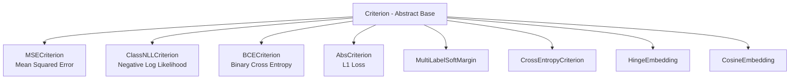

## Integration Boundaries

### External System Integration

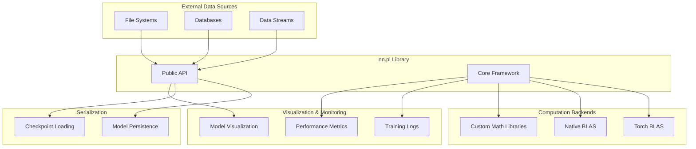

## Technology Stack

### Lua/Torch Implementation

| Layer | Technology | Purpose |
|-------|-----------|---------|
| Language | Lua 5.1+ | Dynamic scripting with C integration |
| Framework | Torch7 | Tensor computation framework |
| Computation | TH (Torch Tensor Library) | Low-level tensor operations |
| FFI | LuaJIT FFI | C library bindings |
| Testing | torch.Tester | Unit testing framework |
| Build | CMake | Cross-platform build system |

### Prolog Implementation

| Layer | Technology | Purpose |
|-------|-----------|---------|
| Language | SWI-Prolog 7.0+ | Logic programming, educational |
| Paradigm | Pure Prolog | No external dependencies |
| Data Structures | Prolog Terms | Native representation |
| Testing | PlUnit | Prolog unit testing |

### C Implementation (Partial)

| Layer | Technology | Purpose |
|-------|-----------|---------|
| Language | C | Performance-critical operations |
| Build | CMake | Cross-platform build |
| Integration | Lua C API | Torch integration |

## Design Patterns and Principles

### 1. Composite Pattern

Containers and Modules follow the Composite pattern, allowing:
- Uniform treatment of individual modules and compositions
- Recursive composition of arbitrary depth
- Simplified client code through polymorphism

### 2. Template Method Pattern

The Module base class defines the algorithmic skeleton:
- `forward()` calls `updateOutput()`
- `backward()` calls `updateGradInput()` and `accGradParameters()`
- Subclasses override specific steps

### 3. Strategy Pattern

Different modules implement different computation strategies:
- Transfer functions: different activation strategies
- Criterions: different loss computation strategies
- Optimizers: different parameter update strategies

### 4. Builder Pattern

Sequential container allows incremental network construction:
```lua
mlp = nn.Sequential()
mlp:add(nn.Linear(10, 20))
mlp:add(nn.Tanh())
mlp:add(nn.Linear(20, 10))
```

## Performance Considerations

### Memory Management

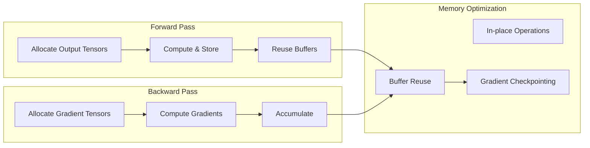

### Computational Optimization

1. **Batch Processing**: Process multiple samples simultaneously
2. **Vectorization**: Use BLAS for matrix operations
3. **In-place Operations**: Minimize memory allocations
4. **Gradient Accumulation**: Efficient mini-batch training
5. **Lazy Evaluation**: Defer computations when possible

## Extension Points

The architecture provides several extension points:

1. **Custom Modules**: Extend `Module` base class
2. **Custom Criterions**: Extend `Criterion` base class
3. **Custom Containers**: Extend `Container` base class
4. **Custom Optimizers**: Implement optimizer interface
5. **Backend Implementations**: Add new computation backends

## Security Considerations

1. **Input Validation**: Tensor dimension checking
2. **Numerical Stability**: Safeguards against overflow/underflow
3. **Resource Limits**: Memory and computation bounds
4. **Serialization Safety**: Secure model loading/saving

## Future Architecture Evolution

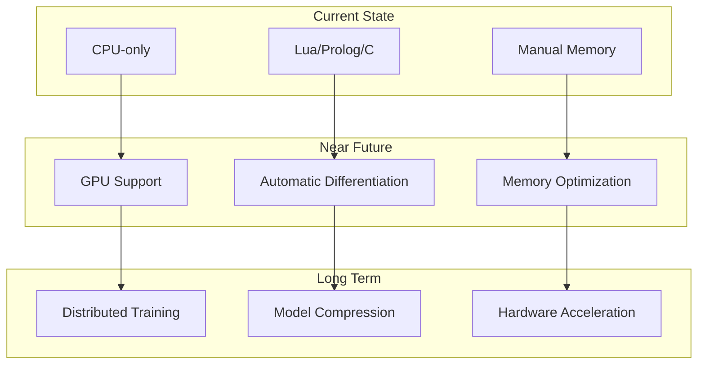

## References

- **Torch/nn Documentation**: Original inspiration and design reference
- **Neural Networks and Deep Learning**: Theoretical foundations
- **Design Patterns**: Software architecture patterns used
- **BLAS Specification**: Low-level computation interface
